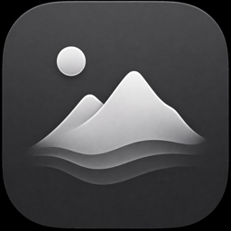

# Lumen Wallpapers

<p align="center">
  
</p>

<p align="center">
  A native macOS app for living desktop wallpapers, built with SwiftUI.
</p>

<p align="center">
  <a href="https://github.com/OWNER/LumenWallpapers/releases"></a>
  <a href="https://github.com/OWNER/LumenWallpapers/actions/workflows/build.yml"></a>
  <a href="LICENSE"></a>
  
</p>

> Replace `OWNER/LumenWallpapers` in the badge links above with the GitHub account and repository name before publishing.


## Why Lumen

Lumen keeps your desktop calm and alive without subscriptions, accounts, or a cloud library. Pick a built-in procedural scene, import your own media, and send it to one display or all of them.

## Features

- **Procedural wallpaper** rendered natively with SwiftUI `Canvas` and `TimelineView`.
- **Local media library** for `.mov`, `.mp4`, `.m4v`, `.avi`, `.jpg`, `.jpeg`, `.png`, and `.heic`.
- **Smooth looping video** with muted playback and a 30 FPS procedural budget.
- **Display targeting** for the built-in display, external displays, or all displays.
- **Menu bar controls** for quick pause/resume, launch-at-login, and app access.
- **Lock Screen snapshot** that uses a static frame while macOS is locked and restores the previous desktop images when disabled.
- **Offline-first by design**: imported media stays in `~/Library/Application Support/LumenWallpapers/Library`.

## Install

### Download a release

1. Open the [Releases](../../releases) page.
2. Download the latest `LumenWallpapers-<version>.dmg`.
3. Open the DMG and drag **Lumen Wallpapers** to **Applications**.
4. Launch the app from Applications.

Release DMGs built with the included script are universal (`arm64` + `x86_64`). Unsigned builds may show a Gatekeeper warning; see [Release signing](#release-signing) for a trusted distribution build.

### Build from source

Requirements:

- macOS 14 Sonoma or newer
- Xcode 16 or newer (the project is currently developed with Xcode 26)

The Xcode project is the canonical build entry point:

```sh
git clone https://github.com/OWNER/LumenWallpapers.git
cd LumenWallpapers
xcodebuild -project LumenWallpapers.xcodeproj \
  -scheme LumenWallpapers \
  -configuration Release \
  -destination 'platform=macOS' \
  CODE_SIGNING_ALLOWED=NO build
```

For a quick command-line smoke build:

```sh
swift build
```

## Use your own wallpapers

Click `+` in the top bar or **Import media** in the preview. Lumen copies selected files into its private library, so moving the originals later will not break your collection. Rename or remove imported items from their card controls.

For smooth loops, use a 16:9 or 16:10 clip at 1080p or 4K, around 10–30 seconds long, with matching first and last frames. Wallpaper audio is muted by design.

Only import media you created yourself or have permission to use. Good sources for openly licensed material include [Pexels](https://www.pexels.com/), [Pixabay](https://pixabay.com/), [Mixkit](https://mixkit.co/), [NASA media](https://images.nasa.gov/), and [Wikimedia Commons](https://commons.wikimedia.org/).

## Release signing

The repository includes [`scripts/build-release.sh`](scripts/build-release.sh), which builds a universal app and creates a DMG. With no signing variables it produces a local, ad-hoc build. For distribution outside your own Mac, use a paid Apple Developer account and set:

```sh
export DEVELOPER_ID_APPLICATION="Developer ID Application: Your Name (TEAMID)"
export KEYCHAIN_PROFILE="lumen-notary"
./scripts/build-release.sh 1.0.0
```

Create the `notarytool` keychain profile once with `xcrun notarytool store-credentials`. The script signs with hardened runtime, submits the DMG for notarization, and staples the ticket. A notarized, Developer ID-signed DMG is what gives users the normal “open” experience without an unidentified-developer warning.

## macOS limitation

Public macOS APIs do not allow third-party apps to replace or animate the actual password/login screen. Lumen provides a live desktop wallpaper and an optional static Lock Screen snapshot; true password-screen replacement would require unsupported system modifications.

## Privacy

Lumen does not include analytics, advertising, accounts, or network requests. See [PRIVACY.md](PRIVACY.md) for the data-handling summary.

## Contributing

Bug reports, feature ideas, and pull requests are welcome. Please read [CONTRIBUTING.md](CONTRIBUTING.md) first.

## License

Lumen Wallpapers is available under the [MIT License](LICENSE).

