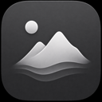
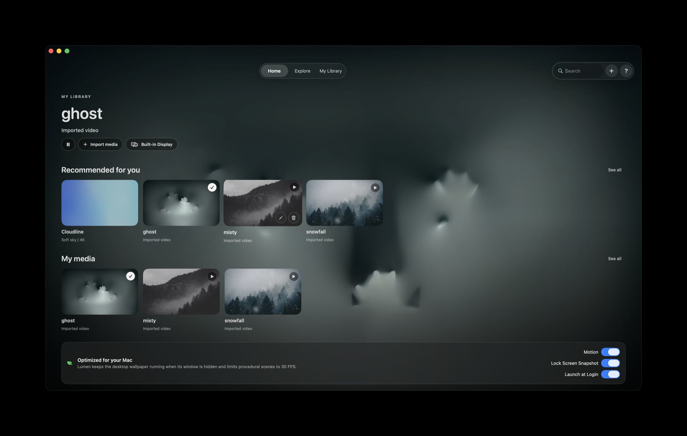

# Lumen Wallpapers

<p align="center">
  
</p>

<p align="center">
  A native macOS app for living desktop wallpapers, built with SwiftUI.
</p>

<p align="center">
  
  <a href="LICENSE"></a>
  
</p>



## Why Lumen

Lumen keeps your desktop calm and alive without subscriptions, accounts, or a cloud library. Pick a built-in procedural scene, import your own media, and send it to one display or all of them.

## Features

- **Procedural wallpaper** rendered natively with SwiftUI `Canvas` and `TimelineView`.
- **Local media library** for `.mov`, `.mp4`, `.m4v`, `.avi`, `.jpg`, `.jpeg`, `.png`, and `.heic`.
- **Smooth looping video** with muted playback and a 30 FPS procedural budget.
- **Display targeting** for the built-in display, external displays, or all displays.
- **Menu bar controls** for quick pause/resume, launch-at-login, and app access.
- **Video Wallpaper** registered in macOS **System Settings > Wallpaper**, for both the desktop and idle/lock screen.
- **Offline-first by design**: imported media stays in `~/Library/Application Support/LumenWallpapers/Library`.

## Install

### Download a release

1. Open the [Releases](../../releases) page.
2. Download the latest `LumenWallpapers-<version>.dmg`.
3. Open the DMG and drag **Lumen Wallpapers** to **Applications**.
4. Launch the app from Applications.

Release DMGs built with the included script are universal (`arm64` + `x86_64`). Unsigned builds may show a Gatekeeper warning; see [Release signing](#release-signing) for a trusted distribution build.

For a trusted local or ad-hoc build, Control-click **Lumen Wallpapers.app**, choose **Open**, and confirm. If macOS still blocks it after the first launch attempt, open **System Settings > Privacy & Security > Open Anyway**. Only bypass Gatekeeper for artifacts you built yourself or obtained from a source you trust.

### Build from source

Requirements:

- macOS 14 Sonoma or newer
- Xcode 16 or newer (the project is currently developed with Xcode 26)

The Xcode project is the canonical build entry point:

```sh
cd LumenWallpapers
xcodebuild -project LumenWallpapers.xcodeproj \
  -scheme LumenWallpapers \
  -configuration Release \
  -destination 'platform=macOS' \
  CODE_SIGNING_ALLOWED=NO build
```

For a quick command-line smoke build:

```sh
swift build
```

## Use your own wallpapers

Click `+` in the top bar or **Import media** in the preview. Lumen copies selected files into its private library, so moving the originals later will not break your collection. Rename or remove imported items from their card controls.

For smooth loops, use a 16:9 or 16:10 clip at 1080p or 4K, around 10–30 seconds long, with matching first and last frames. Wallpaper audio is muted by design.

Select an imported video and turn on **Video Wallpaper** in the performance panel or menu bar. Lumen adds a copy of the video and a generated preview to macOS's Aerials catalog, where it appears under the **Lumen Wallpapers** category in **System Settings > Wallpaper**. It selects the same asset for Desktop and Idle, which is the wallpaper macOS uses behind the lock-screen interface. Turn the option off to remove Lumen's catalog entry and restore the previous wallpaper selection.

Only import media you created yourself or have permission to use. Good sources for openly licensed material include [Pexels](https://www.pexels.com/), [Pixabay](https://pixabay.com/), [Mixkit](https://mixkit.co/), [NASA media](https://images.nasa.gov/), and [Wikimedia Commons](https://commons.wikimedia.org/).

## Release signing

The repository includes [`scripts/build-release.sh`](scripts/build-release.sh), which builds a universal app and creates a DMG. With no signing variables it produces a local, ad-hoc build. For distribution outside your own Mac, use a paid Apple Developer account and set:

```sh
export DEVELOPER_ID_APPLICATION="Developer ID Application: Your Name (TEAMID)"
export KEYCHAIN_PROFILE="lumen-notary"
./scripts/build-release.sh 1.0.1
```

Create the `notarytool` keychain profile once with `xcrun notarytool store-credentials`. The script signs with hardened runtime, submits the DMG for notarization, and staples the ticket. A notarized, Developer ID-signed DMG is what gives users the normal “open” experience without an unidentified-developer warning.

## macOS limitation

macOS owns the password and account UI used by `Control-Command-Q`; Lumen does not replace or modify it. The Video Wallpaper feature registers the video with the user-level Aerials catalog and applies it as the desktop and idle wallpaper, so macOS renders its normal lock interface over the moving video. This integration is available on macOS releases that provide the Aerials video wallpaper catalog.

## Privacy

Lumen does not include analytics, advertising, accounts, or network requests. See [PRIVACY.md](PRIVACY.md) for the data-handling summary.

## Contributing

Bug reports, feature ideas, and pull requests are welcome. Please read [CONTRIBUTING.md](CONTRIBUTING.md) first.

## License

Lumen Wallpapers is available under the [MIT License](LICENSE).
